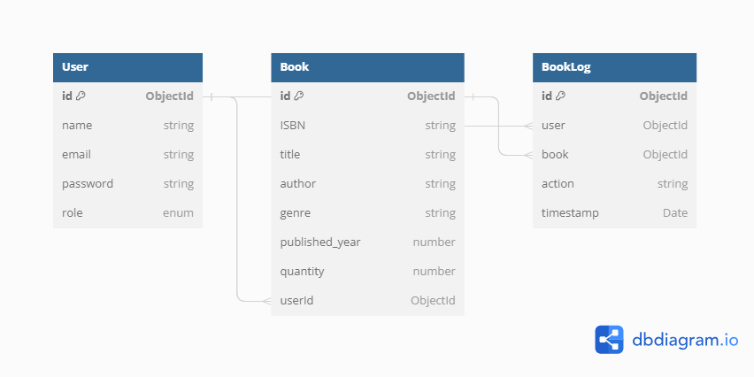

# Indigg Library Management System

This project involves the development of a robust backend API for an Library Management System application. The primary focus of the project is on the logic and functionality that powers the Library Management platform and the backend's routes, use cases, and careful consideration of edge cases are crucial for building a reliable and functional Library Management System. This backend can later be integrated with various frontend platforms to create a complete Library Management solution.


## Deployed Link

```bash
 
```

## API Documentation Swagger

```bash
 
```

## Key Features

- **High Prformance**: insures that the Library Management site can handle high traffic loads efficiently.
- **Scalability**: easily adapt to increased user demand by adding more servers or resources as needed.
- **API Devlopment**: building APIs, to interact with frontend interfaces, mobile apps, and third-party services.
- **Database Integration**: can integrate with MongoDB, offering flexibility in choosing the right database solution.
- **Security**: protect sensitive customer information, such as encryption, authentication, and authorization mechanisms.
- **Inventory Management**: efficiently manage book inventory, borrowing processing, and retuen processing.
- **User Authentication and Authorization**: ensures that only authorized users can access certain parts of the website.

## Tech Stack

- Backend: Node.js


## Getting Started

### Installation

1. Clone the repository:

   ```
   git clone https://github.com/aman1722/Indigg_Library_Management_System
   ```
   
2. Install dependencies:
   ```
   npm install 
   ```

3. Application Start
   ```
   npm run server
   ```


## Environment Variables

You will need to set the following environment variables in a `.env` file:

```ini
PORT=`YOUR_REQUIRED_PORT`
MONGO_URL=`YOUR_MONGO_ATLAS_URL`
SALT_ROUNDS=`PROVIDE_A_NUMBER_FOR_HASHING_SALT_ROUND`
JWT_LOGIN_SECRET=`CREATE_A_SECRET_FOR_LOGIN_TOKEN`
```


## Features (with rate limiter middleware limiting requests to 10 per minute)

### Users

- Register as a user.
- Log in with credentials using JWT token for authentication.
- Log out (blacklist the token).
- User can borrow a book.
- User can return the borrowed book.
- User can get his borrowin and return history.
- User can get recommendations basis on his previous borrowing.

### Admin

- Add Books.
- Update Books details.
- Delete Books.


### Books

- Get Paginated Book lists.
- Search book by providing keyword in queary.


## Endpoints Reference

For detailed information on how to use our API, please refer to the [API documentation](docs/ApiDocs.md).


## Welcome Route

| Route           | Endpoint | Description                            | Features          |
| --------------- | -------- | -------------------------------------- | ----------------- |
| Welcome Message | GET /    | Provides a welcome message to the API. | - Welcome message |

## Swagger Docs

| Route           | Endpoint      | Description                       | Features          |
| --------------- | ------------- | --------------------------------- | ----------------- |
| Welcome Message | GET /api-docs | Provides a Documentation for API. | - Welcome message |

## Users

| Route           | Endpoint                       | Description                                                                                              | Features                               |
| --------------- | ------------------------------ | -------------------------------------------------------------------------------------------------------- | -------------------------------------- |
| Register User   | POST /user/register            | Register a new user with provided credentials.                                                           | - User registration                    |
| Login User      | POST /user/login               | Authenticate and log in a user with JWT token.                                                           | - User login with JWT token            |
| Logout User     | POST /user/logout              | Blacklist the token to log out the user securely.(user Must Logged in)                                   | - Secure token blacklisting            |
| Borrow Book     | POST /user/borrow/:bookId      | User can Borrow a book from Library.(user Must Logged in)                                                | - Borrow book using bookId             |
| Return Book     | POST /user/return/:bookId      | User can Return a book which he/she borrowed .(user Must Logged in)                                      | - Return book using bookId             |
| History         | GET /user/book/:bookId/history | User can get the track of borrowing and returning the book by bookId.(user Must Logged in)               | - Get track of Borrowing and Returning |
| Recommendations | GET /user/recommendations      | User get the books recommendations based on his previous borrowing(if applicable).(user Must Logged in)  | - Get recommendations of books         |  

## Admin (Admin Only - Must Login with admin credentials - Dummy Admin Credentials:-{"email":"admin@gmail.com","password":"indigg"})

| Route                    | Endpoint                          | Description                                                                   | Features                       |
| ------------------------ | --------------------------------- | ----------------------------------------------------------------------------- | ------------------------------ |
| Add New Book             | POST /admin/book/add              | Add a new book to the library. (Must Login with admin credentials )           | - Book creation                |
| Update Existing Book     | PATCH /admin/book/update/:bookId  | Update details of already existing book. (Must Login with admin credentials)  | - Update already exists book   |
| Delete Existing Book     | DELETE /admin/book/delete/:bookId | Delete details of already existing book. (Must Login with admin credentials ) | - Delete already exists book   |


## Books

| Route                      | Endpoint                        | Description                                 | Features                      |
| -------------------------- | ------------------------------- | ------------------------------------------- | ----------------------------- |
| Get Books List             | GET /book                       | Retrive Paginated Book list                 | - Paginated Books List        |
| Search Books with Keywords | GET /book/search                | Search Books with Keywords                  | - Search Books From Database  |


```javascript
app.get("/",async(req,res)=>{
    try {
        res.status(200).send({ok:true,message:"Welcome to INDI.GG Backend Assignment!"})
    } catch (error) {
        res.status(501).send({ok:false,error:error.message})
    }
});
```


## Database Schema




## Folder Structure

We maintain a clean and organized folder structure for easy navigation and development. Get familiar with it in the [Folder Structure](docs/FolderStructure.md) document.


